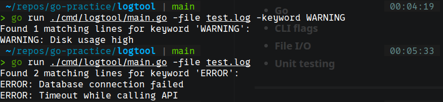

# LogTool - CLI Log Analyzer Built with Go

A command-line tool built in **Go** to parse log files and filter entries by keyword.

---

## Why I Built It

I wanted to practice **Go** while building something practical for **backend** and **DevOps-oriented workflows**.

The goal was to improve my understanding of:

- File processing
- CLI design
- Clean project structure
- Writing maintainable and testable code

---

## Features

- Reads a log file
- Filters lines by keyword
- Outputs matching results
- Structured codebase for maintainability


---

## Tech Stack

- **Go**
- **CLI flags**
- **File I/O**
- **Unit testing** 

---

## Usage

The tool accepts the `-file` flag to specify the log file to process and an optional `-keyword` flag to filter matching entries. If no keyword is provided, it defaults to `ERROR`, but this behavior can be customized by passing a different value with `-keyword`.

## How to run

```bash
go run ./cmd/logtool/main.go -file test.log -keyword WARNING
```

## Example Output

---

## Future Improvements

- **Support multiple keywords**
- **Add case-insensitive search**
- **Export results to a file**
- **Improve error handling and validation**
- **Package as a compiled binary**